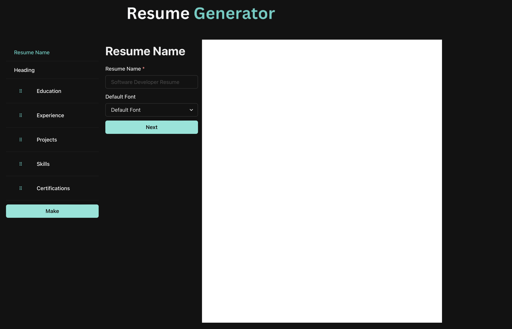

# Create a new Resume in under 10 minutes

In this world of constantly moving forward, and tailoring your resume for new jobs, the task of making a new resume should be easy, and scalable.

Using MERN Stack and Bash Scripting, alongside some basic LaTeX, I wish to make it easy to make a new resume. 

Front-end online at: https://resume-generator-app.onrender.com

Back-end online at: https://resume-generator-app-backend-3.onrender.com

Back-end docker image: https://hub.docker.com/repository/docker/thefjcurve/resume-generator-app-backend/general

Made Using: 
 - MongoDB
 - ExpressJS
 - NodeJS
 - ReactJS
 - Docker
 - LaTeX

## Documentation:

### Project Structure

 - **Backend**
   - *server*.js: Main Server
   - *Dockerfile*: Image that runs on render.com, installs all npm dependencies and texlive to compile LaTeX to PDFs.
   - *controllers*
     - *resumeController.js*: All operations regarding Resumes:
       -  getAllResumes()
       -  getResume()
       -  createResume()
       -  deleteResume()
       -  updateResume()
       -  converPDF()
   - *models*
     - *resumeModel.js*: Predefined model for the resume, talks with MongoDB
   - *routes*
     - *corsConnections.js*: Allows only certain addresses to access the backend
     - *resumes*.js: Assigining html redirects to resumeController functions

- **Frontend**
  - *src*
    - *routes.tsx*: Handles website-side redirects pretty smoothly.
    - *components*:
      - *design*: Unchanging and Parent files.
        - *ErrorPage.tsx*
        - *Home.tsx*
        - *LayoutCreate.tsx*
        - *LayoutEdit.tsx*
        - *Navbar.tsx*
      - *pages*
        - *create-pages*: specifically for ~/resume/create
          - *specific-pages*: children of GenericPages, made for specific resume components
          - *GenericDescriptionField.tsx*
          - *GenericField.tsx*
          - *GenericPage.tsx*
          - *ImportComponent.tsx*
          - *ResumeComponentList.tsx*
          - *ResumeComponents.tsx*
        - *edit-pages*: specifically for ~/resume/edit
          - *ResumeCard.tsx*
          - *ResumeCardSekeleton.tsx*
          - *ResumeContainer.tsx*
          - *ResumeDetails.tsx*
          - *ResumeDetailSekeleton.tsx*
          - *ResumeList.tsx*
        - *LatexPDF.tsx*
    - *context*: Stores and works with local instance of a resume object, specifically when a user is creating a resume, as that must be stored in website cache unless refreshed or pushed
      - *ResumeContext.tsx*: Creating Resume Context, with proper functions.
      - *useResume.ts*: context hook for local components to use.
    - *hooks*: Extends resumeService.ts, includes:
      - deleteResumes(string)
      - getComponent(string, string)
      - getResume(string)
      - getResumes()
      - usePDF(string, string)
      - *latex*: Folder that contains files which convert json objects to LaTeX code.
      - *apiClient.ts*: Links to the backend API and calls resumeController functions as per need.
      - *resumeService.ts*: Extends apiClient.ts specifically for route ~/api/resume

### Project Look 

